

 

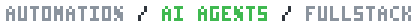

 

<table>
  <tr>
    <td width="340" align="center">
      
    </td>
    <td valign="middle">
      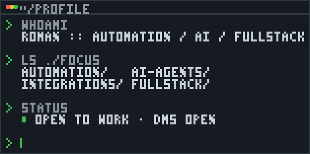
    </td>
  </tr>
</table>

 

  <a href="https://t.me/geekyroma">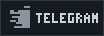</a>
  &nbsp;
  <a href="mailto:romachit11@gmail.com">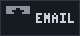</a>

  

## what i do

  <table>
    <tr>
      <td>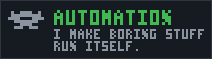</td>
      <td>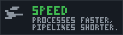</td>
    </tr>
    <tr>
      <td>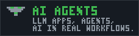</td>
      <td>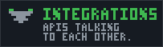</td>
    </tr>
    <tr>
      <td colspan="2">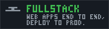</td>
    </tr>
  </table>

 

## toolbox

  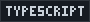
  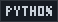
  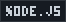
  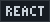
  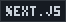
  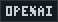
  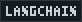
  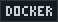
  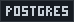

  

  

 

  

